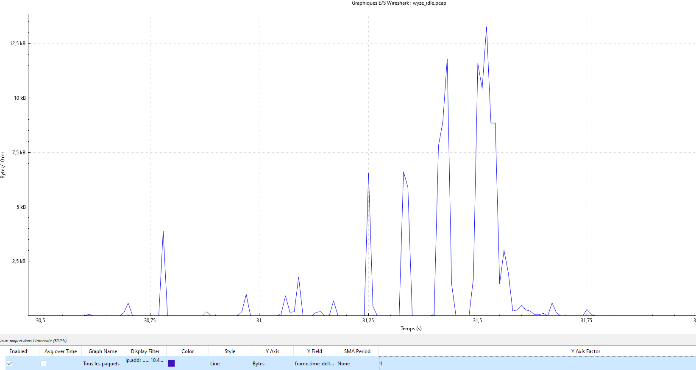
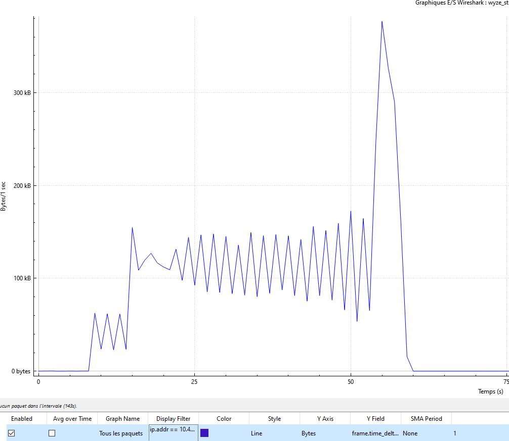
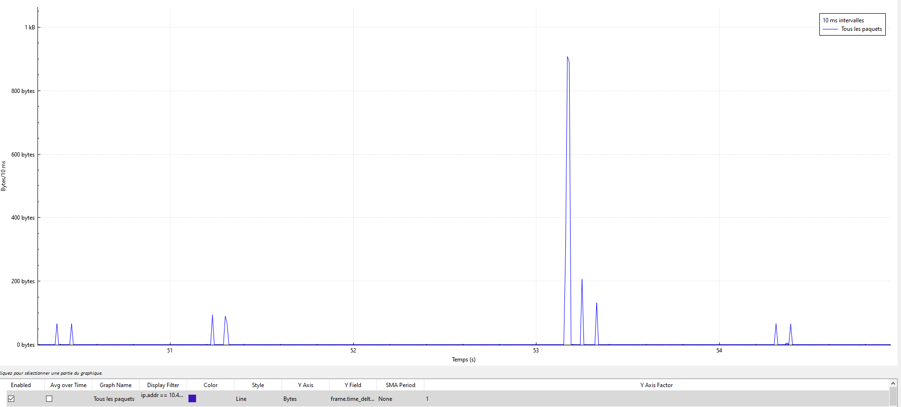

# Week 4 – Timing Pattern Behavioral Leakage Analysis

This week focused on analyzing timing metadata in encrypted Wyze Cam traffic to determine whether device behavior can be inferred without decrypting packets.

## Key Findings
- **Streaming vs Idle states are clearly distinguishable** through packet timing and byte volume.
- **Streaming forms a stable wave pattern**, representing continuous video frame transmission.
- **Idle mode shows sparse and irregular peaks**, corresponding to keep-alives, DNS queries, and cloud synchronization.
- A **large isolated spike** during streaming corresponds to TLS session renegotiation or a keyframe refresh.
- **Behavioral leakage is possible**: observers can infer when the camera is streaming, idle, waking, syncing, or performing maintenance tasks.
- **Motion/sound detection should appear as clustered mini-bursts**, not single spikes. Future captures can confirm this.

## Graphs
### Streaming Pattern

### Idle (Zoomed Out)

### Idle (Zoomed In)

