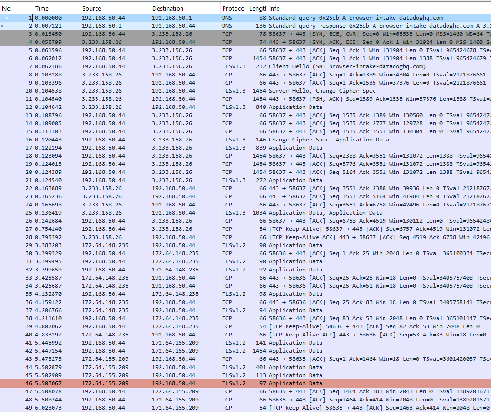

# Week 2 — Router Lab: VPN Capture Analysis

## Objective
Observe and compare network traffic visibility with and without VPN encryption using the Raspberry Pi 5 as a Wi-Fi access point and packet capture node.

## Setup
- Raspberry Pi 5 configured as AP: `PiTestNet`
- Interfaces: `eth0` (WAN uplink), `wlan0` (AP)
- Captures made with `tcpdump`:
  - `week2_capture.pcap` — no VPN
  - `week2_capture_vpn.pcap` — VPN active on mobile device

## Findings
### DNS Query Results
**Without VPN**

**With VPN**

### Without VPN
- DNS queries and TLS handshakes visible.
- Multiple external IPs contacted (Google, Datadog, Cloudflare CDNs).
- Traffic composed of `DNS`, `TLSv1.2/1.3`, and `TCP`.

### With VPN
- All packets encapsulated in `ESP` protocol.
- No DNS queries visible.
- Single remote VPN endpoint visible.
- Payloads and destinations fully encrypted.

## Traffic Overview
| Observation | No VPN | With VPN |
|--------------|--------|----------|
| DNS visible | YES | NO |
| Protocols | DNS, TLS, TCP | ESP |
| Visible IPs | Many | 1–2 (VPN) |
| Readable metadata | Hostnames, SNI | Only IP + timestamps |

### Wireshark Graphs
**No VPN Traffic**

**VPN Traffic**

## Conclusion
When the VPN is enabled, all communication is tunneled through an encrypted channel.  
The Raspberry Pi access point can still measure timing and packet counts but loses visibility into sites visited, DNS lookups, and specific content.  
This demonstrates that VPNs effectively protect user activity from local network observers.

