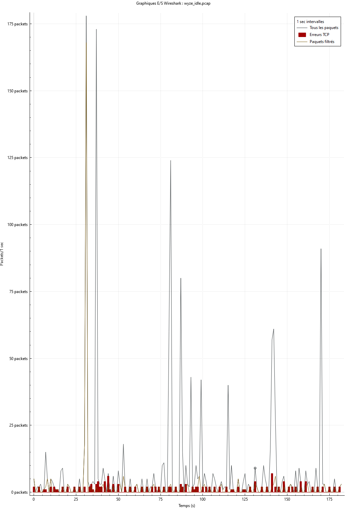
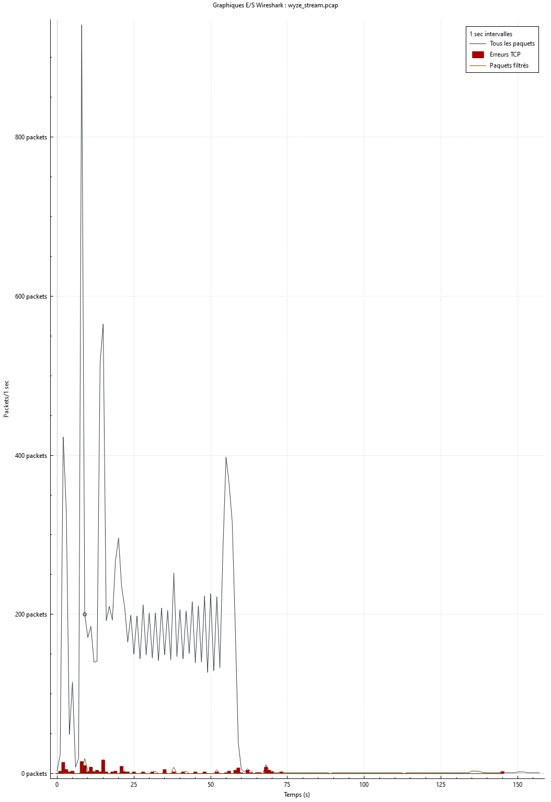
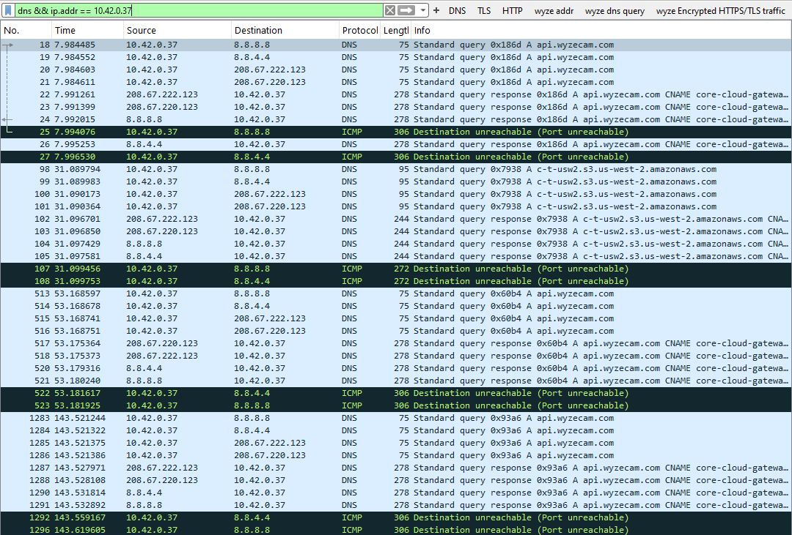
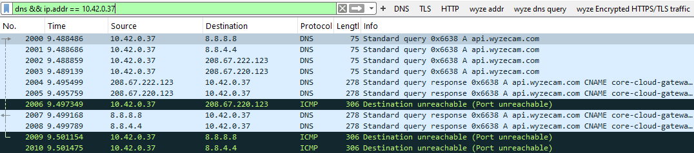
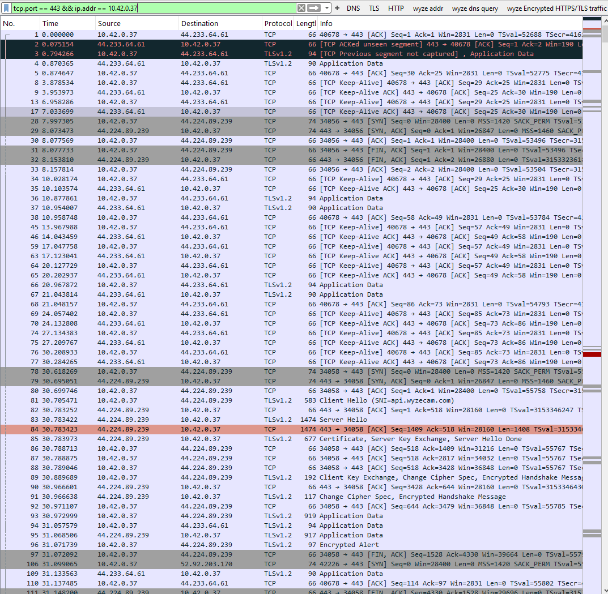
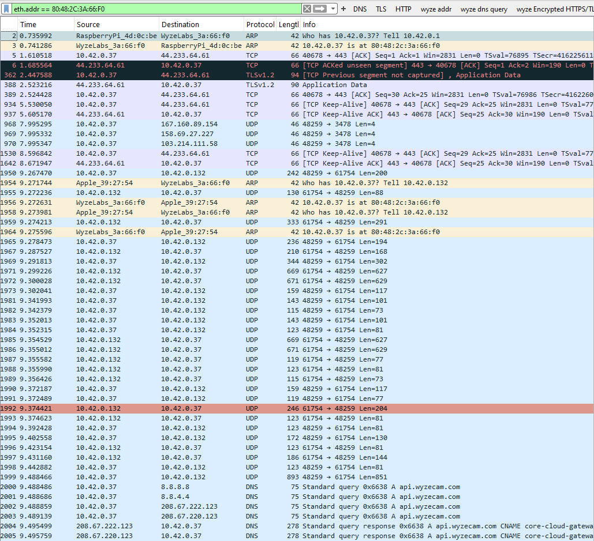

## 1. General Behavior Summary

I captured two sessions:

- **Idle:** 1,475 packets (≈559 KB)  
- **Streaming:** 12,631 packets (≈8,108 KB)

That’s about **9× more packets** and **14× more data** when the camera streams — a strong sign that the device moves from lightweight “control signaling” to heavy encrypted video transfer.

---

## 2. Comparing Graphs — Idle vs Streaming

### Idle Graph

The graph shows occasional, small spikes — short bursts of 50–150 packets/second followed by long quiet periods.

This means the camera is mostly silent, sending only:
- Keep-alive packets (to confirm it’s still online)
- DNS queries like `api.wyzecam.com` or `core-cloud-gateway.wyzecam.com`
- Occasional TLS handshakes with Wyze’s cloud server

**Why:** IoT cameras stay connected even when idle. They maintain a minimal link to the cloud so the mobile app can reach them instantly. The low traffic confirms “heartbeat” or “status update” packets.

---

###  Streaming Graph

We see massive spikes (hundreds of packets/sec) and a steady wave pattern.

This wave-like rhythm is typical of video streaming traffic:
- Each “wave” represents continuous frames of compressed video being uploaded.
- The consistent peaks show streaming data bursts, possibly from UDP/TCP retransmissions or frame chunks.

**Why:** Video streams require steady, high-bandwidth communication.  
Even though Wyze encrypts data (TLS/UDP), the amount and timing clearly expose when the camera is actively sending live video.

---

## 3. DNS Behavior

The DNS captures show repeated lookups like:
-api.wyzecam.com
-core-cloud-gateway.wyzecam.com
-c-t-usw2.s3.us-west-2.amazonaws.com

**Interpretation:**
- These are Wyze’s cloud and AWS relay servers.
- The camera queries them repeatedly because:
  - It’s ensuring it can reach the control servers.
  - During streaming, it negotiates multiple relay endpoints (for WebRTC / STUN / TURN connections).

We also see:
> ICMP Destination unreachable (Port unreachable)

That’s normal — Wyze tries multiple relay endpoints (UDP ports) for NAT traversal; some fail, so we see “unreachable” messages.

---

## 4. Encrypted Traffic

**Filter used:**  
`tcp.port == 443 && ip.addr == 10.42.0.37`

We see mostly:
- `TLSv1.2 Application Data`
- `TCP Keep-Alive`
- `Server Hello`, `Change Cipher Spec`

That means:
- The traffic is end-to-end encrypted — you can’t see the video payload.
- But you can see which servers it connects to (`44.233.64.61`, `44.224.89.239`, etc.), all hosted on AWS.

Even though encrypted, the packet size and frequency clearly differ between idle and streaming states.

**Why:** Encryption hides content but not metadata. Analysts can still infer:
- When the camera is on/off  
- How long a stream lasted  
- How much data it sent  
- Whether it’s uploading video or just staying idle  

---

## 5. MAC-Level Capture

This view confirms:
- My Wyze Cam’s MAC address (`80:48:2C:3A:66:F0`) communicates primarily with the Pi (`10.42.0.1`) and cloud servers on AWS IPs.
- I also saw packets to/from:
  - Apple devices — likely my phone controlling the camera.
  - UDP ports `48259–61754` — dynamic session ports for the video stream.

**Why:** When I open the Wyze app, my phone becomes a control client — it sends a command to Wyze’s cloud, which tells my camera to start streaming, then the stream travels either:
1. Directly between the phone and camera (LAN mode), or  
2. Through Wyze’s AWS relay (cloud mode).

The traffic pattern strongly suggests **cloud relay mode** (video sent to AWS, not local).

---

## 6. Visual Comparison Summary

| Metric       | Idle     | Streaming      | Explanation                               |
|--------------|----------|----------------|-------------------------------------------|
| Packets      | ~1.5 K   | ~12.6 K        | ≈ 9× increase due to continuous streaming |
| File Size    | 559 KB   | 8.1 MB         | ≈ 14× increase in payload                 |
| DNS Queries  | Few      | Many           | More relay negotiations during streaming  |
| Graph Shape  | Sparse   | Dense waveform | Represents video frames transmitted       |
| Protocols    | TCP/TLS  | TCP + UDP + TLS| UDP added for real-time video             |
