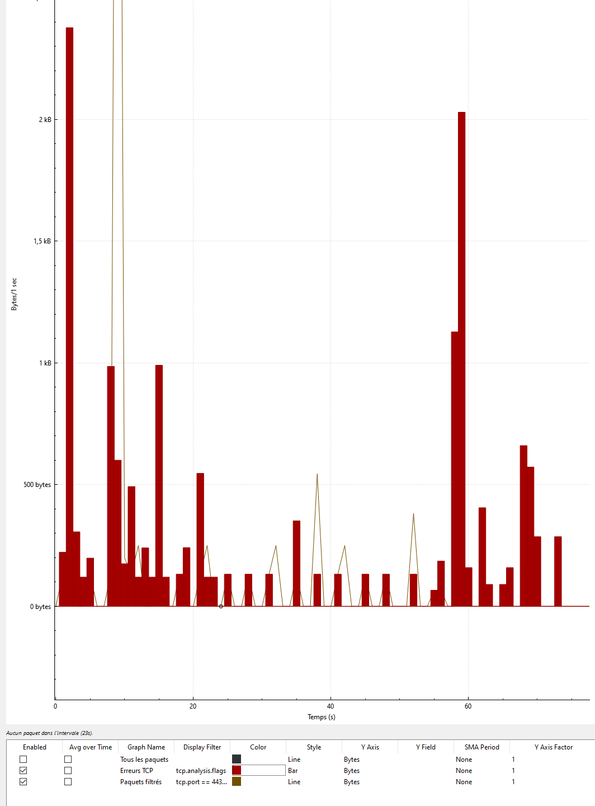

## 1. General Behavior Summary

I captured two sessions:

- **Idle:** 1,475 packets (≈559 KB)  
- **Streaming:** 12,631 packets (≈8,108 KB)

That’s about **9× more packets** and **14× more data** when the camera streams — a strong sign that the device moves from lightweight “control signaling” to heavy encrypted video transfer.

---

## 2. Comparing Graphs — Idle vs Streaming

### Idle Graph

The graph shows occasional, small spikes — short bursts of 50–150 packets/second followed by long quiet periods.

This means the camera is mostly silent, sending only:
- Keep-alive packets (to confirm it’s still online)
- DNS queries like `api.wyzecam.com` or `core-cloud-gateway.wyzecam.com`
- Occasional TLS handshakes with Wyze’s cloud server

**Why:** IoT cameras stay connected even when idle. They maintain a minimal link to the cloud so the mobile app can reach them instantly. The low traffic confirms “heartbeat” or “status update” packets.

---

###  Streaming Graph

We see massive spikes (hundreds of packets/sec) and a steady wave pattern.

This wave-like rhythm is typical of video streaming traffic:
- Each “wave” represents continuous frames of compressed video being uploaded.
- The consistent peaks show streaming data bursts, possibly from UDP/TCP retransmissions or frame chunks.

**Why:** Video streams require steady, high-bandwidth communication.  
Even though Wyze encrypts data (TLS/UDP), the amount and timing clearly expose when the camera is actively sending live video.

---

## 3. DNS Behavior

The DNS captures show repeated lookups like:
-api.wyzecam.com
-core-cloud-gateway.wyzecam.com
-c-t-usw2.s3.us-west-2.amazonaws.com

**Interpretation:**
- These are Wyze’s cloud and AWS relay servers.
- The camera queries them repeatedly because:
  - It’s ensuring it can reach the control servers.
  - During streaming, it negotiates multiple relay endpoints (for WebRTC / STUN / TURN connections).

We also see:
> ICMP Destination unreachable (Port unreachable)

That’s normal — Wyze tries multiple relay endpoints (UDP ports) for NAT traversal; some fail, so we see “unreachable” messages.

---

## 4. Encrypted Traffic

**Filter used:**  
`tcp.port == 443 && ip.addr == 10.42.0.37`

We see mostly:
- `TLSv1.2 Application Data`
- `TCP Keep-Alive`
- `Server Hello`, `Change Cipher Spec`

That means:
- The traffic is end-to-end encrypted — you can’t see the video payload.
- But you can see which servers it connects to (`44.233.64.61`, `44.224.89.239`, etc.), all hosted on AWS.

Even though encrypted, the packet size and frequency clearly differ between idle and streaming states.

**Why:** Encryption hides content but not metadata. Analysts can still infer:
- When the camera is on/off  
- How long a stream lasted  
- How much data it sent  
- Whether it’s uploading video or just staying idle  

---

## 5. MAC-Level Capture

This view confirms:
- My Wyze Cam’s MAC address (`80:48:2C:3A:66:F0`) communicates primarily with the Pi (`10.42.0.1`) and cloud servers on AWS IPs.
- I also saw packets to/from:
  - Apple devices — likely my phone controlling the camera.
  - UDP ports `48259–61754` — dynamic session ports for the video stream.

**Why:** When I open the Wyze app, my phone becomes a control client — it sends a command to Wyze’s cloud, which tells my camera to start streaming, then the stream travels either:
1. Directly between the phone and camera (LAN mode), or  
2. Through Wyze’s AWS relay (cloud mode).

The traffic pattern strongly suggests **cloud relay mode** (video sent to AWS, not local).

---

## 6. Visual Comparison Summary

| Metric       | Idle     | Streaming      | Explanation                               |
|--------------|----------|----------------|-------------------------------------------|
| Packets      | ~1.5 K   | ~12.6 K        | ≈ 9× increase due to continuous streaming |
| File Size    | 559 KB   | 8.1 MB         | ≈ 14× increase in payload                 |
| DNS Queries  | Few      | Many           | More relay negotiations during streaming  |
| Graph Shape  | Sparse   | Dense waveform | Represents video frames transmitted       |
| Protocols    | TCP/TLS  | TCP + UDP + TLS| UDP added for real-time video             |

## 6. Understanding the TCP Error Graph (Wireshark Visualization)

This zoomed-in I/O Graph provides a deeper look at the camera’s live stream behavior and reliability.

### 7. What the Red “TCP Error” Bars Mean

In Wireshark, the red bars (from the display filter `tcp.analysis.flags`) represent **TCP reliability events** — moments when the protocol had to correct packet delivery issues.  
These include:

| Type of TCP Event | Meaning | Why It Happens |
|--------------------|----------|----------------|
| **Retransmission** | A packet was sent again because the first one wasn’t acknowledged | Normal on Wi-Fi; occasional packet loss |
| **Dup ACK** | Receiver acknowledged the same packet twice | Sender retransmitted before the first ACK arrived |
| **Out-of-Order** | Packets arrived in the wrong order | Common when multiple video frames are transmitted simultaneously |
| **Spurious Retransmission** | A packet was resent unnecessarily | Usually due to jitter or network delay |

**In short:** Red bars don’t mean failure — they show the **self-healing mechanism** of TCP, ensuring that even lost or delayed frames are resent so the stream stays stable.

---

###  What the Graph Shows

- The **early tall red bars** indicate connection setup and initial handshakes between the Wyze Cam and Wyze’s cloud servers. This is when the camera establishes its encrypted TLS session.
- The **middle section**, with shorter, rhythmic red spikes, represents **steady streaming** where occasional packets are lost and resent.
- The **final large red bar** marks the **end of the session** — connection closure, TLS teardown, or stream stop.

Together, these red segments visualize **how actively the TCP protocol is working** to maintain smooth video transmission over Wi-Fi.

---

###  The Brown/Black Line (`tcp.port == 443`)

This line shows all encrypted traffic sent to Wyze’s cloud servers over HTTPS (port 443).  
You can think of it as the **actual video upload rate** — the more consistent the line, the more stable the stream.

When the brown line spikes and red bars appear together:
- It means the stream is under load (high bitrate video).
- More retransmissions occur because larger data bursts increase packet loss risk.

When the line flattens and red bars disappear:
- The stream is idle or stable — no missing packets to resend.

---

### Interpreting the Graph

| Section of Graph | Behavior | Interpretation |
|------------------|-----------|----------------|
| Left Side | High red bars | Stream initialization, TLS handshakes |
| Middle | Wavy brown line + small red spikes | Stable streaming with minor retransmissions |
| Right Side | Tall red bar | Connection teardown or end of stream |
| Few or no red bars | Clean connection | Low packet loss, stable signal |

---

### Why This Matters

Even though Wyze encrypts all data (TLSv1.2 on port 443), **encryption doesn’t hide metadata** like timing, packet size, or retransmission rate.  
By analyzing this TCP error pattern, we can infer:

- When the stream starts and stops  
- How much network correction occurs  
- The reliability of the Wi-Fi link between the Pi and the Wyze Cam  
- Whether the stream was cloud-relayed (TCP-heavy) or peer-to-peer (UDP-heavy)

This confirms that during streaming, **the Wyze Cam relies heavily on TCP retransmission** to guarantee complete video delivery to its cloud relay servers — even at the cost of speed.

---

**Summary:**
The red “TCP Error” bars in the I/O Graph don’t represent broken communication but rather TCP’s built-in reliability in action. They visualize how the Wyze Cam continuously corrects small Wi-Fi losses while maintaining a steady encrypted stream to the cloud.
