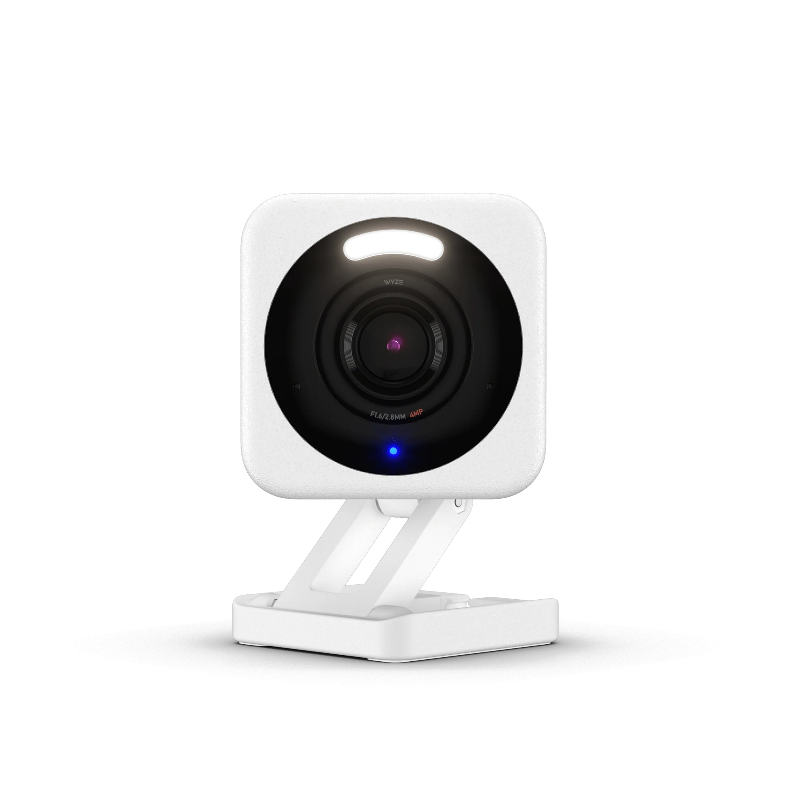

# Week 3 – IoT Camera Traffic Analysis (Wyze Cam v4)



## 1️⃣ Objective
Observe and compare the network behavior of a Wyze Cam v4 when **idle** (powered on but not streaming) versus when **actively streaming video**, to analyze traffic volume, frequency, and connection patterns.

---

## 2️⃣ Experimental Setup

| Component | Description |
|------------|-------------|
| **IoT Device** | Wyze Cam v4 (MAC `80:48:2C:3A:66:F0`) |
| **Access Point** | Raspberry Pi 5 broadcasting SSID `PiTestNet` |
| **Uplink** | Ethernet (`eth0`) to home network |
| **Capture Interface** | `wlan0` using `tcpdump` |
| **Capture Duration** | 3 minutes each (Idle vs Streaming) |
| **Capture Tool** | `tcpdump -i wlan0 -w week3_iot_camera/pcaps/... host 10.42.0.37` |

---

## 3️⃣ Captured Data Overview

| State | Duration | Packets Captured | File Size | Notes |
|:------|:----------|:----------------|:-----------|:------|
| **Idle** | 3 min | **1 475 packets** | **559 KB** | Camera connected to cloud, periodic DNS & keep-alive |
| **Streaming** | 3 min | **12 631 packets** | **8 108 KB** | Continuous encrypted TLS and UDP streams for video feed |

📈 **Observation:**  
Streaming generated ≈ 9× more packets and ≈ 14× more data — a clear distinction between passive connectivity and active data transfer.

---

## 4️⃣ Wireshark Analysis

### A. Traffic Type Breakdown
- **DNS Queries:** `api.wyzecam.com`, `core-cloud-gateway.wyzecam.com`
- **TLS Sessions:** Encrypted connections on port 443 to Wyze cloud servers
- **UDP STUN:** Ports 3478 and 19302 used for video session setup and NAT traversal
- **Protocol Summary:** Mostly TLS/TCP during idle; additional UDP bursts during streaming

### B. Key Filters Used
```text
ip.addr == 10.42.0.37
dns && ip.addr == 10.42.0.37
tcp.port == 443 && ip.addr == 10.42.0.37
udp.port == 3478 || udp.port == 19302
