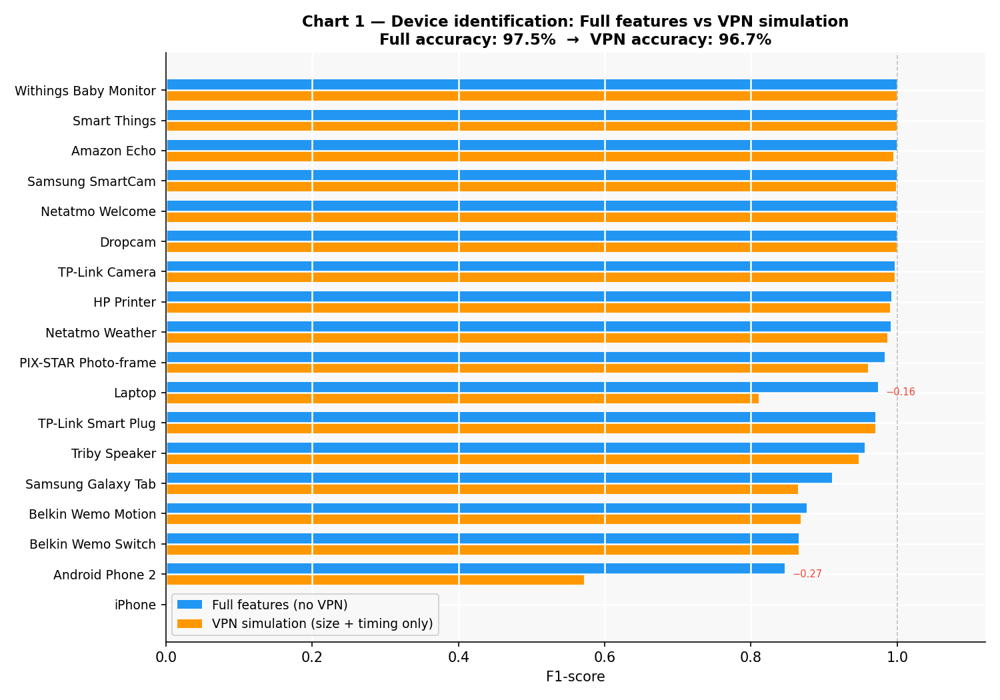
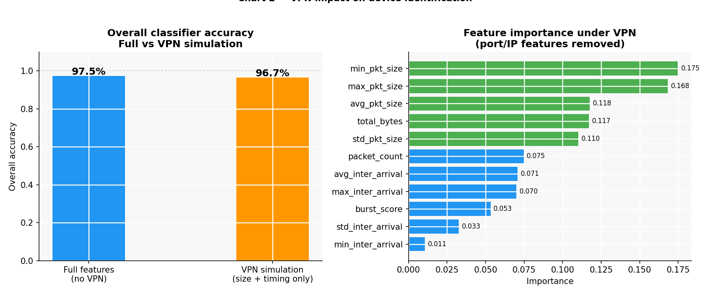

# Week 5b — VPN Simulation: Does a VPN Protect Your Device Identity?

## The Question

In Week 2, we showed that a VPN hides DNS queries and destination IPs from a local observer — all traffic collapses into a single encrypted tunnel to the VPN server.

This raises a natural follow-up:

> *If an attacker can no longer see ports or destination IPs, can they still identify smart home devices from traffic alone?*

---

## What a VPN Actually Hides

When a user connects through a VPN, all device traffic is wrapped inside an encrypted tunnel. From the perspective of a passive observer on the network, this is what disappears:

| Feature | Without VPN | With VPN |
|---|---|---|
| Destination IP | Visible — reveals which servers the device contacts | Hidden — only the VPN server IP is visible |
| Destination port | Visible — reveals protocols used (443, 80, 1883...) | Hidden — all traffic exits on the VPN port |
| TCP vs UDP ratio | Visible | Hidden — encapsulated inside VPN protocol |
| Number of unique servers contacted | Visible | Hidden |
| Port 443 / Port 80 ratio | Visible | Hidden |

What **cannot** be hidden by a VPN, because it exists at the packet level before encryption:

| Feature | Visible under VPN? |
|---|---|
| Packet sizes | Yes — the outer VPN packet size reflects the inner payload size |
| Inter-arrival timing | Yes — when packets are sent is still observable |
| Packet count and volume | Yes — total bytes and activity rate are still measurable |
| Burst patterns | Yes — rapid successive packets are still visible as bursts |

---

## Simulation Method

To simulate VPN conditions, the classifier was re-run with the 6 port and IP features removed, keeping only the 11 size and timing features:

**Removed (hidden by VPN):**
- `tcp_ratio`
- `udp_ratio`
- `unique_dst_ips`
- `unique_dst_ports`
- `port_443_ratio`
- `port_80_ratio`

**Remaining (still visible under VPN):**
- `packet_count`, `total_bytes`
- `avg_pkt_size`, `std_pkt_size`, `min_pkt_size`, `max_pkt_size`
- `avg_inter_arrival`, `std_inter_arrival`, `min_inter_arrival`, `max_inter_arrival`
- `burst_score`

Everything else — dataset, window size, classifier, train/test split — was kept identical to Week 5.

---

## Result

| Scenario | Features used | Accuracy |
|---|---|---|
| Full (no VPN) | 17 | **97.5%** |
| VPN simulation | 11 | **96.7%** |
| **Accuracy drop** | | **−0.8%** |

Removing 6 features — everything a VPN conceals — dropped accuracy by less than 1%.

---

## What Survived as the Most Important Features

Under VPN conditions, the classifier relied almost entirely on packet size:

| Rank | Feature | Importance |
|---|---|---|
| 1 | `min_pkt_size` | 17.5% |
| 2 | `max_pkt_size` | 16.8% |
| 3 | `avg_pkt_size` | 11.8% |
| 4 | `total_bytes` | 11.7% |
| 5 | `std_pkt_size` | 11.0% |

This makes sense: each IoT device has a characteristic packet size fingerprint. A smart plug sends tiny control packets. A camera sends large video payloads. A weather sensor sends small, infrequent updates. These size signatures survive VPN tunneling because the outer packet must be large enough to carry the inner payload — the attacker can still measure the size of what is being sent, just not what it contains or where it is going.

---

## What This Means

**A VPN is not a defense against device fingerprinting.**

Even with a VPN active, an observer can still identify smart home devices with 96.7% accuracy — nearly identical to the 97.5% achieved without a VPN.

The core privacy threat identified in Week 5 is not defeated by a VPN because the threat relies on *how* devices communicate (size, timing, volume), not *what* they communicate or *where*.

This is significant because VPNs are commonly recommended as a privacy tool. For general browsing, they are effective — they hide websites visited and content transmitted. But for IoT device fingerprinting, they provide almost no protection.

---

## Connection to Previous Weeks

| Week | Finding |
|---|---|
| Week 2 | VPN hides DNS queries and destination IPs from local observer |
| Week 5 | Device identity can be inferred from traffic metadata alone (97.5% accuracy) |
| **Week 5b** | **VPN removes port/IP features but accuracy only drops to 96.7% — packet size alone is enough** |

---

## Charts

### Chart 5 — Per-device F1-score: Full vs VPN simulation

### Chart 6 — Overall accuracy drop and surviving feature importance

